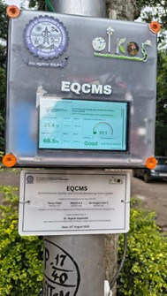
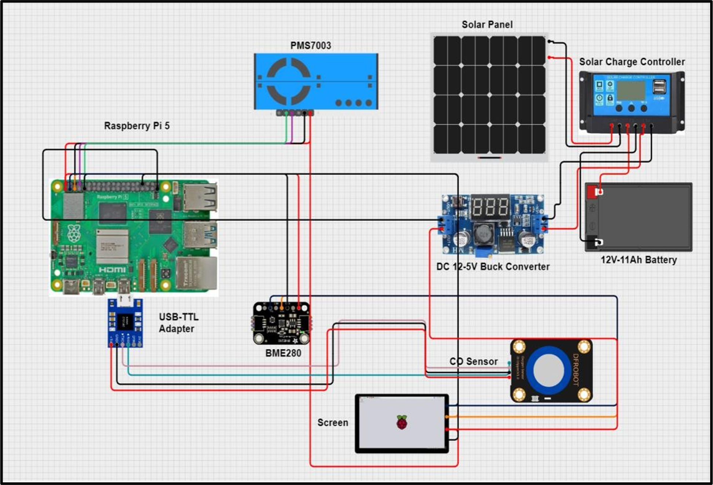
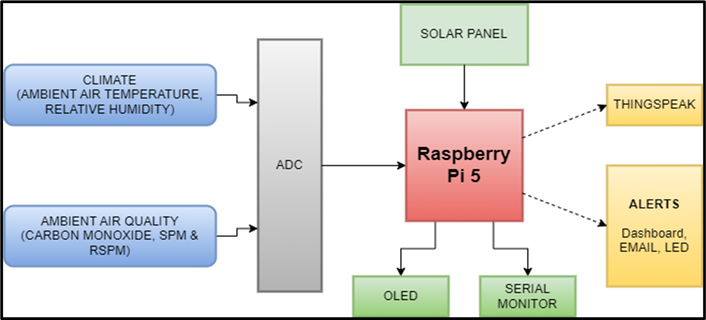
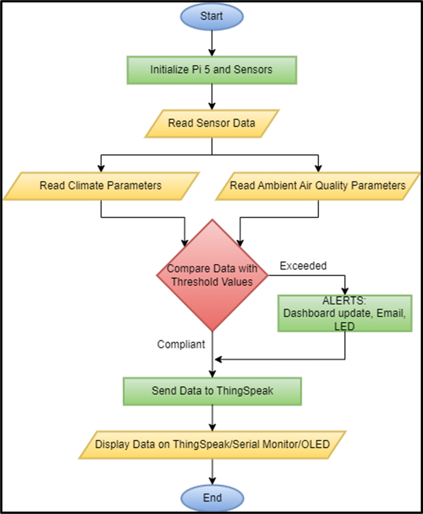
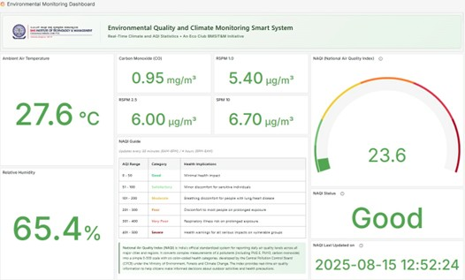
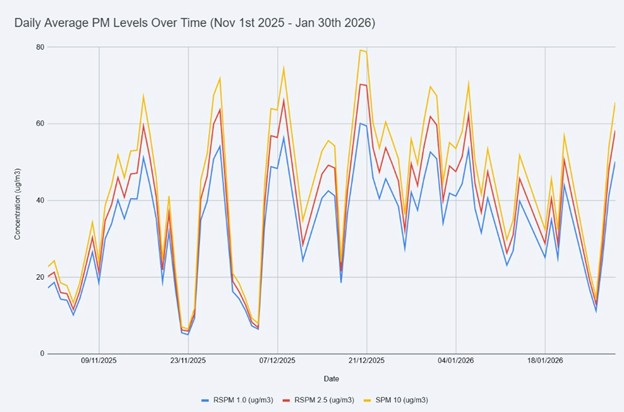
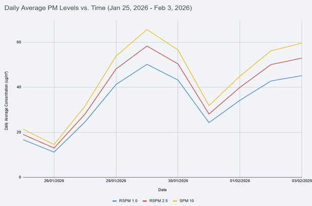
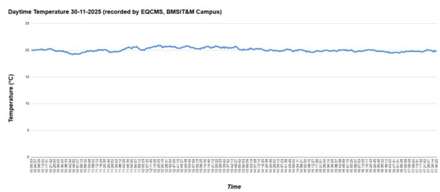

# 🌍 EQCMS – Environmental Quality & Climate Monitoring System

> **An industrial-grade, solar-powered IoT environmental monitoring node deployed on the BMSIT&M campus. Monitors PM1.0, PM2.5, PM10, CO, temperature, and humidity in real-time through a live Grafana dashboard.**


---

## 📌 Project Overview

EQCMS is a permanent smart-campus environmental monitoring infrastructure developed at **BMS Institute of Technology & Management (BMSIT&M)**.

The system continuously measures:

* 🌫️ PM1.0
* 🌫️ PM2.5
* 🌫️ PM10
* 🧪 Carbon Monoxide (CO)
* 🌡️ Temperature
* 💧 Relative Humidity

The collected data is processed locally, transmitted to a cloud platform, visualized through Grafana dashboards, and used to calculate the **National Air Quality Index (NAQI)** in real time.

The system has operated continuously since **August 2025**, generating a validated long-term environmental dataset for research and analysis.

---

## 💰 Funding

This project was supported through institutional innovation funding provided by **BMS Institute of Technology & Management (BMSIT&M), Bengaluru**.

| Funding Agency                                     | Amount      |
| -------------------------------------------------- | ----------- |
| BMS Institute of Technology & Management (BMSIT&M) | ₹70,000     |
| **Total Funding**                                  | **₹70,000** |

The funding supported industrial-grade sensor procurement, embedded hardware development, solar power infrastructure, deployment, and long-term environmental monitoring activities.

---

## 📸 Deployed System

<p align="center">
  
  <br>
  <i>EQCMS node deployed on the BMSIT&M campus since August 2025</i>
</p>

---

## 🏗️ System Architecture

```text
[Solar Panel 18V/20W]
            ↓
[PWM Charge Controller]
            ↓
[12V 14Ah Li-Ion Battery]
            ↓
[Raspberry Pi 5]
      ↓
 ┌──────────────┬───────────────┬──────────────┐
 │              │               │
 ▼              ▼               ▼
SN-GCJA5      PS1-CO-1000    SEN0438 RS485
PM Sensor     CO Sensor      Temp/Humidity
 │              │               │
 └──────────────┴───────────────┘
                ↓
     Edge Processing (NAQI)
                ↓
       MQTT Telemetry
                ↓
      Grafana Dashboard
                ↓
       LED Display Unit
```

---

## 📐 Design Documentation

<p align="center">
  
  
  <br>
  <i>Circuit Diagram (Left) and Block Diagram (Right)</i>
</p>

<p align="center">
  
  <br>
  <i>System Flow Diagram</i>
</p>

---

## 🔧 Hardware Components

| Component            | Model                    | Purpose                                 |
| -------------------- | ------------------------ | --------------------------------------- |
| Main Controller      | Raspberry Pi 5           | Edge processing, MQTT, NAQI computation |
| PM Sensor            | Panasonic SN-GCJA5       | PM1.0, PM2.5, PM10 Monitoring           |
| CO Sensor            | Amphenol PS1-CO-1000-MOD | Carbon Monoxide Detection               |
| Temp/Humidity Sensor | DFRobot SEN0438 RS485    | Environmental Monitoring                |
| Solar Panel          | 18V, 20W                 | Primary Power Source                    |
| Battery              | 12V, 14Ah Li-Ion         | Energy Storage                          |
| Charge Controller    | 30A PWM                  | Solar Charging Management               |
| Display              | LED Display              | On-Site Visualization                   |
| Enclosure            | IP-Rated Polycarbonate   | Outdoor Weather Protection              |

---

## 🏭 Industrial-Grade Sensor Selection

### Panasonic SN-GCJA5

* Laser scattering technology
* PM1.0, PM2.5 and PM10 discrimination
* Auto-calibration support
* Long operational life

### Amphenol PS1-CO-1000-MOD

* Solid Polymer Electrolyte technology
* High CO selectivity
* Low drift characteristics
* > 5 year lifespan

### DFRobot SEN0438

* RS485 Modbus RTU communication
* Industrial differential signaling
* Noise-resistant outdoor operation
* High accuracy sensing

---

## 📊 Environmental Data Insights

### Live Dashboard Snapshot

* 🌡️ Temperature: **27.6°C**
* 💧 Humidity: **65.4%**
* 🧪 CO: **0.95 mg/m³**
* 📈 NAQI: **23.6 (Good Category)**

<p align="center">
  
  <br>
  <i>Real-time Grafana Dashboard</i>
</p>

---

### Long-Term Air Quality Trends

Key observations between **November 2025 and January 2026**:

* Seasonal inversion effects observed during winter
* PM10 peaks frequently exceeded 60–70 µg/m³
* Daily fluctuations correlated with traffic intensity
* Stable long-term sensor performance

<p align="center">
  
</p>

<p align="center">
  
</p>

---

### Significant Event Analysis – Cyclone Ditwah

**Date:** November 30, 2025

Observations:

* Temperature remained nearly constant between 19–21°C
* Heavy cloud cover suppressed daytime heating
* Validated sensor reliability under severe weather conditions

<p align="center">
  
</p>

---

## ⚙️ Software Stack

### Edge Processing

* Python 3
* Raspberry Pi OS

### Communication

* MQTT Protocol
* UART Interfaces
* RS485 Modbus RTU

### Cloud Visualization

* Grafana Dashboard
* Historical Data Logging
* Environmental Analytics

### Alerting

* NAQI Threshold Alerts
* Heat Index Alerts
* Environmental Notifications

---

## 📍 Deployment Details

**Location:** BMSIT&M Campus, Bengaluru

**Installation Site:**
First electric pole along the campus double road.

**Placement Benefits:**

* High solar exposure
* Direct monitoring of traffic emissions
* Continuous environmental exposure
* Representative urban campus environment

**Operational Since:** August 2025

---

## 🏆 Recognition

* 🥇 Innovator Award 2025 – BMSIT&M
* 🌍 Supports UN SDG 3 (Good Health & Well-Being)
* 🏙️ Supports UN SDG 11 (Sustainable Cities & Communities)
* 🌱 Supports UN SDG 13 (Climate Action)

---

## 👥 Team

| Name              | USN        |
| ----------------- | ---------- |
| K S Nitish        | 1BY23EC052 |
| Sri Srujan Hari T | 1BY23EC106 |
| Tarun Patil       | 1BY23EC113 |

### Faculty Mentor

**Dr. Rajesh Gopinath**
Professor, Department of Civil Engineering
Key Liaison, Eco Club, BMSIT&M

---

## 🔮 Future Scope

* Multi-node campus deployment
* Predictive environmental modelling
* Smart campus environmental intelligence
* Noise pollution monitoring
* Water quality sensing integration
* Mobile application development
* AI-assisted environmental forecasting

---

## 📬 Contact

For technical discussions, research collaborations, project demonstrations, or dataset enquiries:

📧 **[tarunpatil018@gmail.com](mailto:tarunpatil018@gmail.com)**

🏫 **BMS Institute of Technology & Management (BMSIT&M)**
Yelahanka, Bengaluru – 560119
Karnataka, India 🇮🇳

---

<p align="center">
⭐ Developed at BMS Institute of Technology & Management (BMSIT&M) ⭐
</p>

<p align="center">
🌍 Supporting Sustainable Environmental Monitoring & Smart Campus Infrastructure 🌍
</p>
